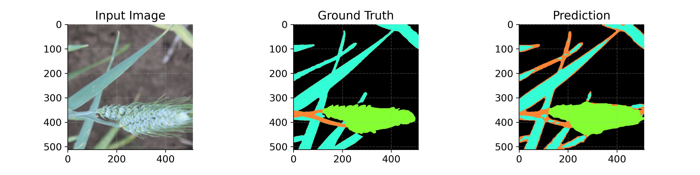
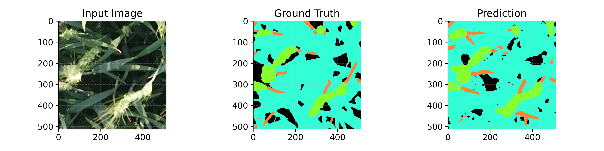
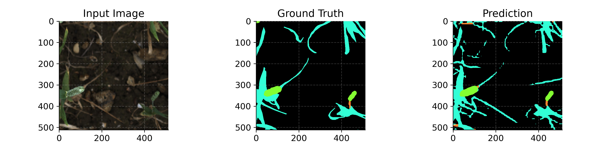
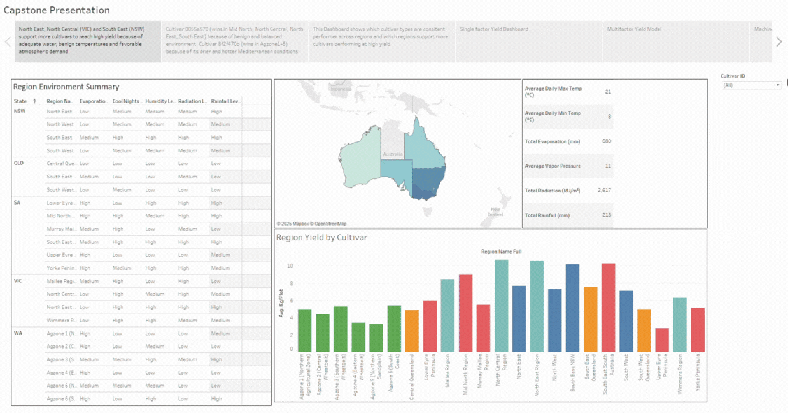

# Integrated Agronomic Analytics System 🌾
**Machine Learning Yield Prediction & Computer Vision Plant Phenotyping**

## 📖 Executive Summary
Wheat contributes to ~20% of global calories and over A$10 billion annually to the Australian economy, yet yield outcomes are highly sensitive to complex, non-linear interactions between climate, cultivars, and management practices. 

This data science project bridges the gap between regional environmental data and micro-level plant traits. I developed a dual-pipeline system featuring a **Machine Learning yield forecasting model** and a **Computer Vision organ segmentation tool**, wrapped into an interactive dashboard to drive actionable agricultural decision-making.

## 🛠️ Technical Stack
* **Languages:** Python
* **Computer Vision:** PyTorch, Torchvision, Segmentation Models PyTorch (SMP)
* **Machine Learning:** Scikit-Learn (Random Forest, Gradient Boosting, SVR, PCA)
* **Data Engineering & Analysis:** Pandas, NumPy, Matplotlib, Seaborn
* **Deployment & Cloud:** HPC (Rangpur) for privacy-compliant model training

---

## 🧠 Pipeline 1: Regional Yield Prediction (Machine Learning)
Traditional simulation models often fail to capture complex environmental relationships or require immense computational overhead. This pipeline scales predictive analytics to regional levels.

* **Objective:** Forecast wheat yield (kg/plot) based on tabular environmental data, daily weather records, and cultivar types.
* **Models Evaluated:** Random Forest (RF), Support Vector Regression (SVR), Gradient Boosting (GB), and Principal Component Analysis (PCA) with Linear Regression.
* **Key Achievements:** * Handled severe data imbalances and high-dimensionality weather data through robust preprocessing and feature engineering.
  * Identified **Random Forest** as the optimal baseline model, providing highly accurate predictions while maintaining critical feature interpretability for stakeholders.

---

## 👁️ Pipeline 2: Fine-Grained Plant Phenotyping (Computer Vision)
To understand yield at the biological level, we need to extract traits (like head-leaf ratio or stem density) directly from field imagery.

* **Objective:** Perform precise semantic segmentation on field images to classify pixels into four categories: Background, Wheat Head, Stem, and Leaf.
* **Architectures Built:** U-Net, SegFormer, and DeepLabV3+.
* **Key Achievements:**
  * Fine-tuned **DeepLabV3+** delivered the highest overall accuracy.
  * Successfully overcame severe class imbalance, proving highly robust at identifying thin, difficult-to-segment minority classes like wheat stems.

### Visual Results: Image Segmentation
The sample outputs below highlight the DeepLabV3+ model's accuracy on unseen test data. 

**Understanding the Visuals:**
* **Left Panel (Input):** The raw RGB field image of the wheat crop.
* **Middle Panel (Ground Truth):** The human-annotated mask indicating the exact location of the wheat heads (green), stems (orange), and leaves (blue).
* **Right Panel (Prediction):** The model's generated output. As demonstrated, the model successfully distinguishes between overlapping plant organs and effectively isolates the thin stem structures, which is traditionally a highly challenging task in agricultural computer vision.

---

## 📊 Interactive Decision Dashboard
To translate these complex agronomic models into actionable insights, I developed an interactive Tableau dashboard. The dashboard allows stakeholders to explore yield predictions alongside environmental factors and cultivar performance visually.

### Dashboard Demonstration
Below is a walkthrough of the interactive features, including regional yield filtering and cultivar performance analysis:

---
*Project completed as part of the Master of Data Science program at The University of Queensland.*
